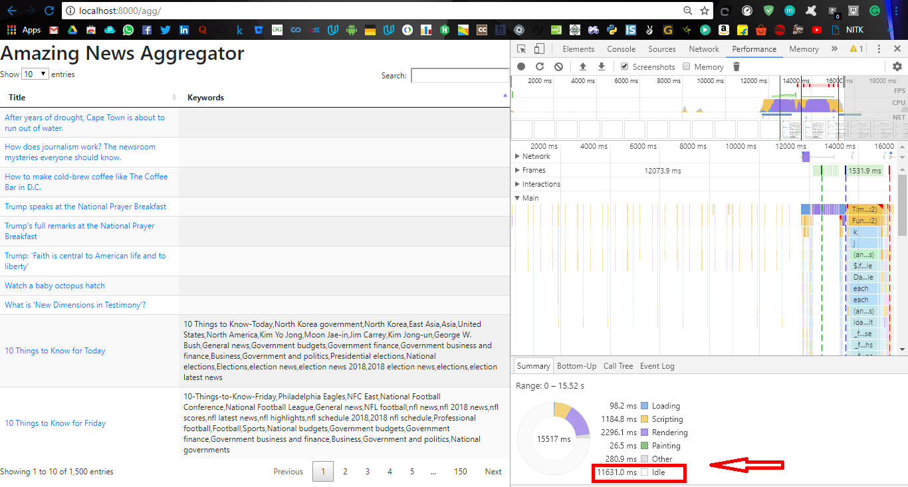
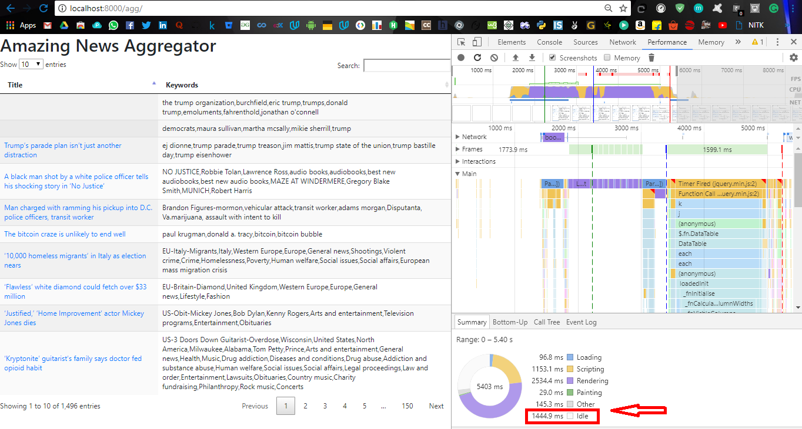

# News Aggregator

This is a web application which collects daily news from The Washington Post website using their sitemap url.<br>

In this web app I have demonstrated how we can use <b>Go Routines</b> to speed up the loading speed of the site by reducing the idle time using <b>Concept of Concurrency</b><br>

Goroutines are functions or methods that run concurrently with other functions or methods. Goroutines can be thought of as light weight threads. The cost of creating a Goroutine is tiny when compared to a thread. On Go we can run hundreds of thousands or millions of goroutines.

<h2>How to use</h2>

### Requirements
Go must be installed to run the program.<br>
To install Go follow the official site instructions <a>https://golang.org/doc/install</a>

### Steps

1. Clone the repository


    ```
        https://github.com/shushantkumar/NewsAggregator-Webapp.git
    ```
2. Move into the directory  
    
    ```
        cd NewsAggregator-Webapp
    ```       
3. To run the version with Concurrency implemented 

    ```
        go run final_withconc.go
    ``` 
4. To run the version with Concurrency not implemented 

    ```
        go run before_conc.go
    ```
   and open http://localhost:8000 in your browser  
<br>

<h2> Working </h2>

* The file before_conc.go access sitemaps without any go routines. The idle time while loading was 11631.0 ms (avg around 11500 ms for other tries).<br>
* Since the web app accesses hundreds of sitemaps and it sends request for each sitemap and waits for response it wastes a lot of time incresing the idle time.<br> 



* To reduce the loading time I used Go Routines<br> 
* The file final_withconc.go implements the same function but uses Go Routines for accessing each internal sitemaps, so basically when one request is sent other requests are also sent concurrently without waiting for previous request to get back the response.<br>
* After implementing go routines for this web application the idle time went down to 1444.9 ms (avg around 1450 ms for other tries).<br>



* The basic concept used is concurrency. We also use <b>Channels</b> to provide concurrency by breaking it into chunks of news elements.<br> 
* Synchronization needs to be there while using go routines. To implement it I imported "sync". Go provides another built in feature <b>defer</b> and functions under sync - Done(), Add() and Wait() <br>


